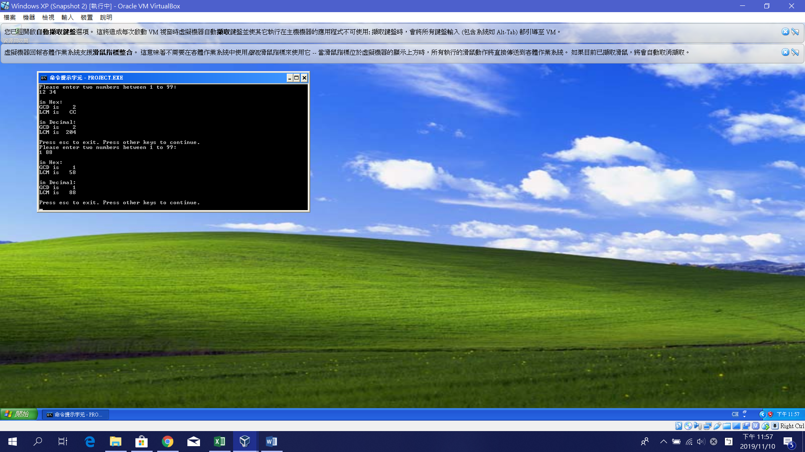
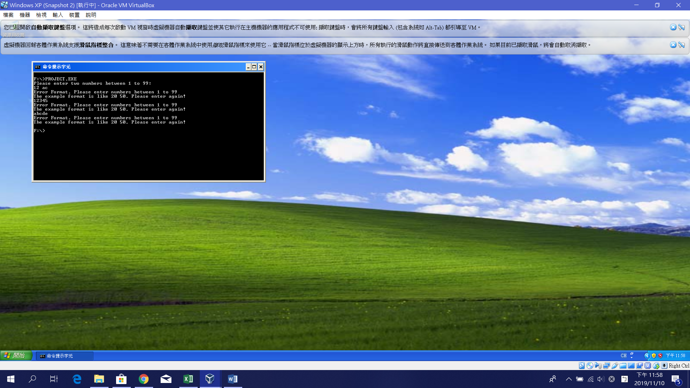

# 使用組合語言求最大公因數與最小公倍數

# Highest Common Factor & Least Common Multiple Calculation by Assembly Code

NTUST Electrical Engineering μPI Fall, 2019 Midterm Project 

國 立 台 灣 科 技 大 學

微 算 機 概 論 實 習

指 導 教 授：陸敬互 教 授

班 級                ：四電二甲

學 生                ：黃鈺善

學 號                ：B10707049

建檔日期： 2019/11/11

一、學習成果

  此程式為求兩個2位數數字之最大公因數與最小公倍數，使用8086組合語言所撰寫，。

  程式分為主程式與3個巨集檔，主程式檔名為Project.asm。三個巨集分為，ProjectPrint.h處理螢幕輸出，getNum.h處理鍵盤輸入，MathCompute.h處理運算部分。

  程式設計的部分，以人性化為發想，從輸入數字到輸出結果均考慮便利且直覺的操作。

  程式功能:

1. 輸入兩個介於0至99間的二位數字，輸入的方式為「num1 num2」。
2. 使用中斷16h，AH = 00h偵測鍵盤輸入。文字顯示及Backspace功能均能使用。
3. 若鍵入個位數字如8，則鍵入8，不須特地鍵入08
4. 偵測不符合規定的輸入格式，格式不符合則要求重新輸入。
5. 輸出為16進制及10進制的最大公因數與最小公倍數
6. 0遮蔽，若計算結果為008F，則螢幕輸出8F，方便判讀。

  主程式引入3個.h檔，從Program\_Start標籤開始依照程式流程分別呼叫不同的巨集，顯示完結果後，若使用者按下Esc則離開程式，按下其他按鍵則跳至Program\_Start，繼續執行程式。

  ProjectPrint.h程式包含2個巨集。printStr處理字串輸出，引入一個參數。printNum處理16進位的數字輸出，欲輸出的數字放在CX暫存器中。

  getNum.h包含一個巨集getNum，為接收鍵盤輸入的巨集。主要流程為：

1. 偵測按鍵是否為特殊按鍵（Esc、Enter、Backspcae），若為Esc則結束程式，為Enter則完成輸入，為Backspace則刪除一個字。
2. 若輸入數字或空白鍵則將其儲存到參數陣列中。由於這個程式為計算二個2位數字，因此最多輸入5個字，如：  12 34，超過則無法再輸入。
3. 按下Enter，輸入完成。檢查輸入格式是否正確，為介於1-99間的數字。若輸入有個位數字，如1，則進行移位及補0動作，方便接下來ASCIIDecimal與Combine兩個巨集計算。
4. 檢查完成，巨集結束。

  MathCompute.h包含了4個巨集。ASCIIDecimal引入一參數，將陣列中的ACSII Code轉換為數字。Combine傳入一參數，將參數陣列中的數字合併，如
  
| 1 | 2 |   | 3 | 4 |
| --- | --- | --- | --- | --- |

則合併前兩位為12存於BX暫存器，合併最後兩位為34存於CX暫存器。Computation將計算2數字之最大公因數及最小公倍數，將最大公倍數存於CX暫存器，最小公倍數存於AX暫存器。
HextoDecimal則將BX暫存器中的數值，如123Fh，轉換為4671，並轉換為ASCII Code存於參數陣列中，方便螢幕顯示。

二、實習結果 (輸入兩個數字後最大公因數與最小公倍數的小黑窗結果截圖)

Figure 1. 正確輸入的顯示畫面，可以見到輸入個位數字1時，不必輸入為01。

Figure 2. 錯誤的輸入示範及偵錯功能

三、心得 

  這次的報告撰寫取得最大公因數與最小公倍數的程式，有二個2位數輸入。除了基本功能，更思考了程式可精進的部分，如：更人性化的輸入輸出設計、檢查輸入格式是否正確等功能。

  使用組合語言寫出來的程式和C相比，是非常冗長的，尤其是加上其他功能後，程式已突破380行；但使用組合語言，更能了解硬體之間的運作，寫起來其實蠻過癮的。寫完這次的期中作業，便能體會高階語言與組合語言之間易讀性的差別。透過這次實習也能了解註解的重要性，組合語言若沒寫上註解，之後便須花費更長的時間做解讀。
